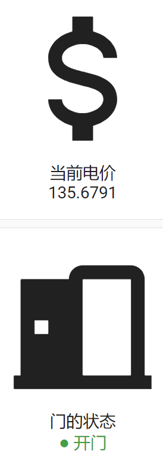

# Hello main Templates

一组实用的 Home Assistant Jinja2 模板宏，封装常用计算和格式化逻辑。

## 安装

### 通过 HACS（需开启实验性功能）
1. HACS → 设置 → 开启**实验性功能**
2. 自定义仓库 → 添加 URL为(  https://github.com/ycxlb/hello-template-main  )，类别选择 **Template**
3. 安装后调用服务 `homeassistant.reload_custom_templates`

### 手动安装
1. 复制 `hello_main.jinja` 文件到 `config/custom_templates/`
2. 调用服务 `homeassistant.reload_custom_templates`

## 使用方法

一、在模板传感器中使用：



{# 格式化持续时间 #}
{{ format_duration(3665) }}  {# 输出：1小时1分 #}

{# 计算电费 #}
{{ electricity_total(states('sensor.nordpool_price'), 0.05, 0.02) }}

{# 状态徽章 #}
{{ state_badge('binary_sensor.door', '开门', '关门') }}

宏名	用途	参数

format_duration(seconds)	格式化秒数为易读时间	seconds: 秒数

electricity_total(spot_price, transport, broker, vat)	计算含附加费的电价	spot_price: 现货价, transport: 输电费, broker: 经纪费, vat: 增值税率

state_badge(entity_id, on_text, off_text)	状态彩色徽章	entity_id: 实体ID

range_color(value, min_val, max_val)	根据数值范围返回颜色	value: 当前值, min/max: 范围

二、在卡片中使用：

在卡片中使用 Template 宏，需要用到 Jinja2 模板语法。以下是几种常见场景：

在 button-card 中使用
button-card 支持 [[[ ... ]]] JavaScript 模板，但不支持直接导入 .jinja 宏。
不过你可以在 state、name、label 等字段中使用 Home Assistant 的模板语法：

通过 entity 绑定模板传感器

1、创建模板传感器
   推荐使用“辅助元素”进行创建模版传感器，使用configuration.yaml创建极不稳定不方便
   
    点击HA的：设置 → 设备与服务 → 辅助元素 → 创建辅助元素/template → 模板 → 模板传感器
    
名称：电费总价

状态模板：
~~~

{{ electricity_total(120, 0.05, 0.02) }}
~~~
其它类似，这儿我用数字代替了实体

名称：门状态徽章

状态模板：

~~~

{{ state_badge('input_boolean.virtual_light_switch', '开门', '关门') }}    
~~~

其它类似，这儿我用数字代替了实体

2、然后在卡片中：

显示当前电价
~~~
type: custom:button-card
entity: sensor.dian_fei_zong_jie
name: 当前电价
icon: mdi:currency-usd
show_state: true          # 显示实体状态
show_units: true          # 显示单位
~~~
显示门的状态
~~~
type: custom:button-card
entity: sensor.men_zhuang_tai_hui_zhang
name: 门的状态
icon: mdi:door-open
show_state: true
show_units: true
~~~

3、在 markdown-card 中可以直接使用
~~~
type: markdown
content: |
  
  门状态：{{ state_badge('binary_sensor.door', '开门', '关门') }}
  运行时间：{{ format_duration(states('sensor.uptime') | int(0)) }}
~~~
